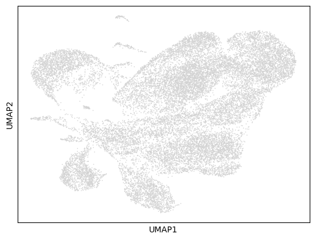
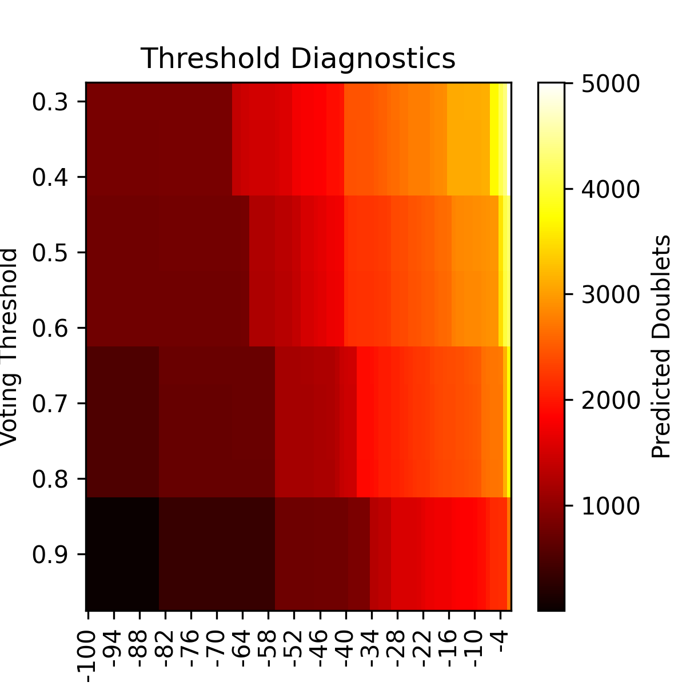
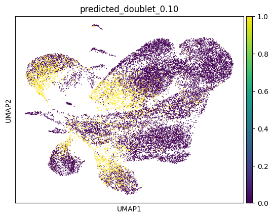
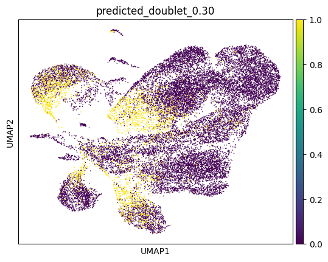
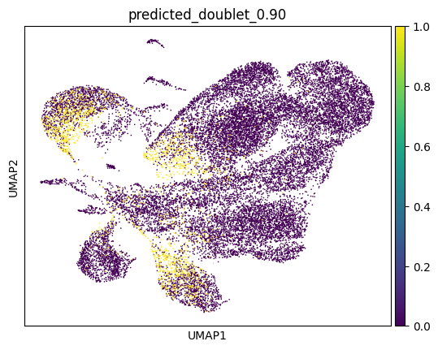

# Analysis of adult Retina WT sample 
# GSE184933: GSM5600681


##  Quality Control Plots

These violin plots visualize cell-level quality metrics **before and after filtering** low-quality cells.

---

###  `violin_QC.png`

This plot shows **raw quality control metrics** (e.g., number of genes per cell, mitochondrial percentage) **before filtering**. It helps ide.pngy thresholds for removing low-quality or dead cells.


---

### Filtering 

We filter cells based on basic quality control metrics:  

- Keep cells with **800–8000 detected genes**  
- Keep cells with **1200–30000 total counts**  
- Remove cells with **high mitochondrial content (>25%)**  

```python
combined_adata = combined_adata[
    (combined_adata.obs['n_genes_by_counts'] > 800) &
    (combined_adata.obs['n_genes_by_counts'] < 8000) &
    (combined_adata.obs['total_counts'] > 1200) &
    (combined_adata.obs['total_counts'] < 30000) &
    (combined_adata.obs['pct_counts_mt'] < 25),
    :
]
``` 

###  `violin_AfterQC.png`

This plot shows the same QC metrics **after filtering**. It confirms that poor-quality cells were successfully removed based on chosen thresholds.


### Sample UMAP 



## Running DoubletDetection 

### Doublets detected at different thresholds



### Doublets marked in yellow at different thresholds 









