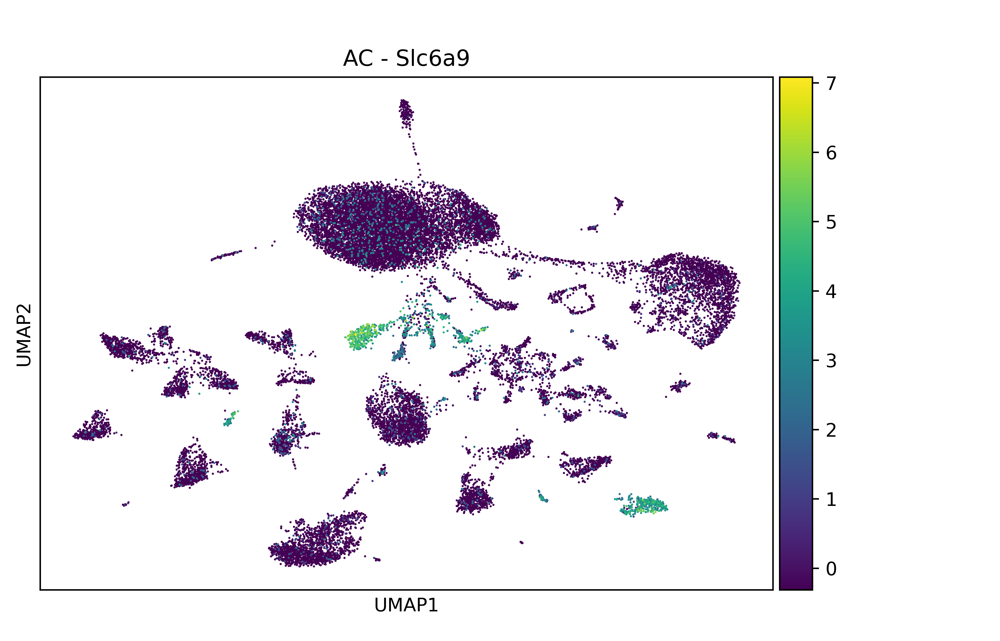
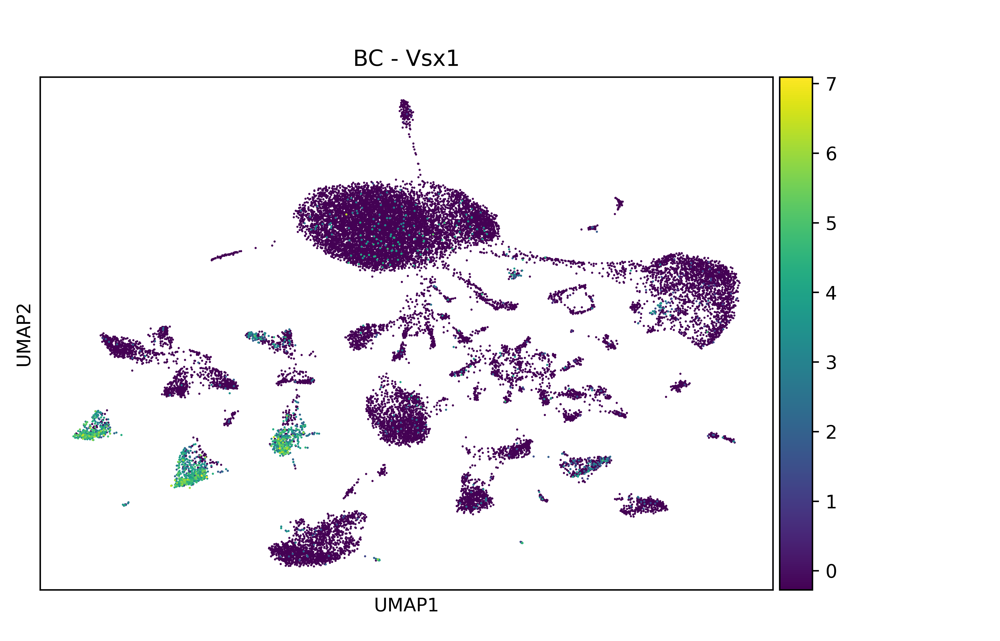

# Analysis of adult Retina WT sample 
# GSE184933: GSM5600681

##  Quality Control Plots

These violin plots visualize cell-level quality metrics **before and after filtering** low-quality cells.

---

###  `violin_QC.png`

This plot shows **raw quality control metrics** (e.g., number of genes per cell, mitochondrial percentage) **before filtering**. It helps ide.pngy thresholds for removing low-quality or dead cells.

---

###  `violin_AfterQC.png`

This plot shows the same QC metrics **after filtering**. It confirms that poor-quality cells were successfully removed based on chosen thresholds.

## Sample UMAP 

## Clusters UMAP 

## Marker Genes Dotplot 

## Marker Genes UMAP 

## Annotations 

